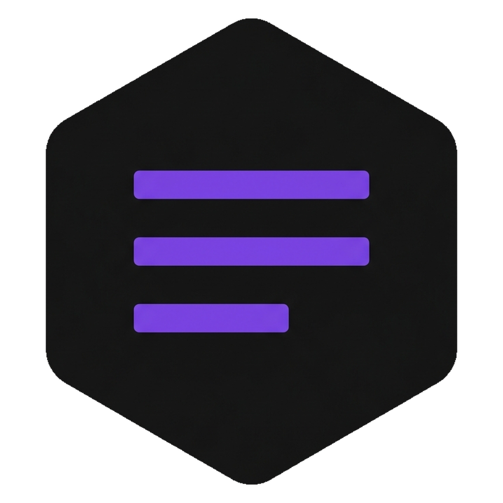

<div align="center">
  
  <h1>Incipit</h1>
  <p><em>Your lecture photos and PDF slides → a written course, in Markdown and PDF.</em></p>
</div>

---

## What it does

Drop your whiteboard photos, slide PDFs, notes. Incipit transcribes, structures, writes, then lays out.

```
   photos            ┌──────────────┐        Course.md   (Obsidian)
   PDF slides  ──▶   │  Incipit  │ ──▶
   notes             └──────────────┘        Course.pdf  (typeset)
```

| | |
|---|---|
| 🖼️ **Reads your photos** | image-by-image transcription, cached — nothing re-read twice |
| ✍️ **Writes properly** | outline then section-by-section drafting, not a summary |
| 🎨 **Typesets** | math (KaTeX), diagrams (Mermaid), colored callouts, highlighting |
| 🔗 **Speaks Obsidian** | vault provisioned automatically, internal links clickable |
| 💸 **Free tier possible** | NVIDIA NIM covers the whole pipeline |

---

## Installation

### Executable (recommended, zero prerequisites)

Download your platform's executable (see **Distribution** below) and double-click. Nothing to install: Python, `uv`, and dependencies are bundled. No terminal window opens.

Then copy `config/keys.env.example` to `config/keys.env` next to the executable (or paste your key directly in the app's **Settings** tab — same effect). For PDF: Chrome or Edge — already on almost every machine.

---

## Requirements

| Mode | Prerequisites |
|---|---|
| **Executable** (downloaded from Releases) | **None** — Python, `uv`, Flask, pywebview, generator, md2pdf, exercices all bundled. Chrome/Edge for PDF (pre-installed on Windows/macOS, `google-chrome` or `chromium` on Linux). |
| **From source** | [`uv`](https://docs.astral.sh/uv/) only — installs all Python deps on first run via PEP 723 headers. Chrome/Edge for PDF. |
| **PDF generation** (both modes) | Chrome / Edge / Chromium must be in `PATH`. Windows/macOS: automatic. Linux: `sudo apt install chromium` or `google-chrome-stable`. |

---

## Distribution

Three standalone executables (Windows, Linux, macOS) — app icon, no visible terminal, nothing to install alongside. `uv` and dependencies are embedded.

**Download**: see [GitHub Releases](https://github.com/Sitarse/Incipit/releases)
(published automatically on every `v*` tag via GitHub Actions).

---

## Engines

| Engine | Cost | Requirements |
|---|---|---|
| **free** (NVIDIA NIM) | free | an `nvapi-…` key |
| **claude-cli** | Claude Code subscription | `claude` CLI installed |

Selected in the UI, stored in `config/keys.env`.