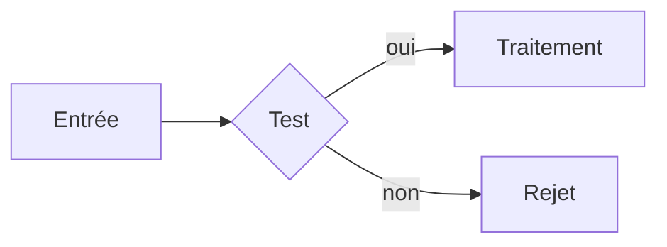

# Cours

Trois matières premières, un seul document :

- **diapos / poly du prof** (PDF) → l'autorité : plan, périmètre, vocabulaire, notations
- **photos de notes** (manuscrit, tableau, écran) → ce qui a réellement été dit et souligné en cours
- **compléments** → ce qui manque pour que le cours tienne debout tout seul

## Entrée

Par défaut `./cours/<nom>/sources/`. Si l'utilisateur donne un autre chemin, l'utiliser.

```
cours/<nom>/sources/   ← photos + PDF déposés ici
cours/<nom>/cours.md   ← sortie
```

Créer l'arborescence si absente. Si `sources/` est vide : dire où déposer, s'arrêter là.

## Procédure

### 1. Inventaire

Lister `sources/`. Classer : PDF (diapos, poly) vs images (notes, tableau).

### 2. Lecture intégrale — aucune source ignorée

- **PDF** : `Read` avec `pages`, par tranches de 20 pages max. Lire le PDF *entier*, pas seulement le début.
- **Images** : `Read` une par une. Lire aussi les marges, les soulignements, les encadrés, les flèches — c'est là qu'est l'insistance du prof.
- **Illisible** : le noter. Ne jamais deviner le contenu d'une photo floue.

### 3. Extraire, séparément, avant de rédiger

Poser dans le scratchpad :

- **Plan du prof** : titres, sections, ordre. C'est le squelette — on ne le réorganise pas.
- **Notations et vocabulaire** : symboles, abréviations, termes exacts du prof. On les reprend tels quels, un examen note le vocabulaire.
- **Insistances** : ce qui revient entre diapos et notes, ce qui est souligné, « à retenir », « tombe à l'examen ».
- **Trous** : étape de démonstration sautée, terme employé jamais défini, exemple annoncé jamais donné, notes qui s'arrêtent en plein milieu.

### 4. Rédiger

Section par section, dans l'ordre du prof. Pour chacune :

1. **Le contenu du prof d'abord**, reformulé en phrases complètes — le style télégraphique des diapos devient de la prose — sans rien retirer ni réordonner.
2. **Fusionner les notes manuscrites** au bon endroit : l'exemple donné à l'oral, la remarque, la précision absente de la diapo.
3. **Combler les trous** repérés en 3.

Le type de séance change la forme :

- **CM** — le cours suivi. Le plan du prof, les définitions, les démonstrations, la théorie.
- **TD** — un exercice par section : énoncé, **méthode** (quelle technique et *pourquoi celle-là*), résolution détaillée, résultat. La méthode compte plus que le résultat : c'est elle qui se rejoue à l'examen. Regrouper à la fin les réflexes récurrents.
- **TP** — objectif, matériel ou outils, protocole étape par étape, mesures et observations, exploitation des résultats, sources d'erreur. Ce qui a mal tourné et pourquoi vaut d'être écrit.

### 5. Calibrer la longueur

La cible : **plus clair qu'une diapo, plus détaillé et corrigé que les notes manuscrites.** Un document qu'on relit seul, sans le prof, sans les diapos.

En pratique, par section de cours : **200 à 400 mots** de texte courant, plus ses formules, ses schémas et ses encadrés. Ces bornes sont un garde-fou, pas un quota — une section vraiment dense a le droit de déborder, une section maigre ne se gonfle pas pour atteindre le seuil.

Le vocabulaire, le récap et l'auto-test viennent en plus : ils ne comptent pas dans la longueur du corps.

**Digeste ne veut pas dire court.** Un cours se lit vite parce qu'il est découpé, hiérarchisé et coloré, pas parce qu'il a été amputé. Devant un cours trop lourd à lire, la réponse est de couper les paragraphes en deux et de sortir les exemples dans leurs encadrés — jamais de retirer du contenu.

**Test à appliquer à chaque paragraphe** : apporte-t-il une information que le précédent n'a pas ? Sinon il saute.

Ce qui se coupe sans hésiter :

- les répétitions entre diapos et notes — l'information est écrite une fois, au meilleur endroit
- le remplissage de diapo : « Introduction », « Nous allons voir », « Plan », rappels de titres
- les reformulations qui ne clarifient rien : dire deux fois la même chose en changeant les mots
- les transitions décoratives entre sections

Ce qui se garde même si ça rallonge :

- une étape de calcul ou de démonstration que le prof a sautée
- la définition d'un terme employé sans avoir été défini
- l'exemple qui rend la notion concrète
- le piège classique et la confusion fréquente

Autrement dit : on coupe le bavardage, jamais le raisonnement.

### 6. Les six encadrés — la couleur porte le sens

Six couleurs, six rôles, pas un de plus. La couleur ne décore pas : elle dit au lecteur comment lire ce qu'il y a dans la boîte, avant même qu'il l'ait lue.

| Encadré | Rôle | Combien |
|---|---|---|
| `> [!example] Exemple` | l'exemple concret, déroulé jusqu'au bout | au moins un par notion importante |
| `> [!tip] À retenir` | l'essentiel de la partie, 1 à 3 lignes | un par partie `##` |
| `> [!danger] Piège` | l'erreur classique, la confusion avec la notion voisine | quand il y en a vraiment un |
| `> [!note] Complément` | ce qui ne vient pas des sources | autant que nécessaire |
| `> [!warning] À vérifier` | source illisible, contradiction diapo/notes | quand ça arrive |
| `> [!question] Auto-test` | les questions de fin | un seul, à la fin |

**Marquer les ajouts reste non négociable.** Tout ce qui ne vient ni des diapos ni des notes va dans un `[!note] Complément`. Sans cette marque le cours est inutilisable pour réviser : à la relecture il faut distinguer d'un coup d'œil ce qui vient du prof (donc examinable) de ce qui est un apport extérieur (donc à vérifier).

Un encadré extrait un élément du cours, il ne remplace pas le texte courant. Une section faite uniquement d'encadrés n'a plus de cours, seulement des marges.

### 7. Images, schémas et formules

Deux jeux d'images arrivent déjà prêts, avec leurs liens `![[...]]` :

- **les photos de notes**, listées en tête de la demande ;
- **les pages de diapos**, rendues une par une — le lien de chaque page est collé dans son en-tête `--- page N ---`, avec ce que la page contient :
  - `SCHEMA OU FIGURE` → la page porte un dessin, un graphe, un tableau que le texte extrait ne rend pas. **C'est celle-là qu'on affiche.**
  - `texte seul` → rien à montrer, le contenu part dans le corps du cours.

Le principe directeur : **le schéma du prof EST le cours** — le redessiner risque de trahir ce qu'il a voulu montrer.

**Afficher l'image en priorité** quand la diapo ou le schéma au tableau est lisible et bien fait. C'est le cas par défaut, et c'est vrai des deux côtés : une diapo qui porte un schéma, un tableau de synthèse, une frise, un graphe — on colle la page, on ne la reconstruit pas. Placer le `![[...]]` à l'endroit du cours où la figure est discutée, **précédé d'une phrase qui dit ce qu'on y regarde** et **suivi d'une légende en italique** qui résume le point clé — jamais un bloc d'images en vrac à la fin.

**Ne pas afficher** les pages marquées `texte seul` : leur contenu part dans le corps du cours, l'image n'apporterait rien. On affiche une page pour ce qu'elle *montre*, pas pour ce qu'elle dit.

**Inversement, une page marquée `SCHEMA OU FIGURE` ne se laisse pas passer.** Son texte extrait se réduit souvent au titre — c'est justement le signe que l'essentiel est dans le dessin, et que le redécrire en prose perdrait le cours. Si la notion correspondante est traitée dans le cours, la figure y va.

**Quand deux sources montrent la même chose**, choisir celle qui montre le mieux : la diapo du prof si elle est propre et complète, la photo des notes si le prof a ajouté au tableau ce que la diapo ne dit pas (une flèche, une annotation, un cas particulier). Les deux ensemble seulement si elles se complètent vraiment — et alors on dit en une phrase ce que la seconde ajoute.

**Redessiner en Mermaid uniquement** quand aucune image ne convient : rien dans les sources, photo illisible ou trop petite, ou schéma qui gagne clairement en clarté à être refait (un organigramme griffonné, un diagramme mal cadré). Redessiner ce qui existe déjà en bon état est du travail perdu et une occasion de fausser le propos du prof. Obsidian rend les blocs ` ```mermaid ` nativement.

````

````

**Réécrire en LaTeX** les formules, matrices et systèmes : `$...$` en ligne, `$$...$$` en bloc. Obsidian rend MathJax. Recopier les notations exactes du prof, pas des équivalentes.

**Un tableau de données reste un tableau Markdown**, pas une image.

Ne jamais inventer les valeurs d'une courbe pour la redessiner : si les chiffres ne sont pas lisibles, on affiche la photo.

### 8. Rendre ça pédagogique — aérer, colorier, relier

L'étudiant qui relit ce cours est visuel. Il retient un schéma, un tableau, un encadré coloré — pas un bloc de prose compacte. **Penser diapo, pas dissertation.** Le cours doit se scanner en diagonale et chaque notion doit sauter aux yeux.

#### Mise en page aérée

- **Un paragraphe = une idée = trois à quatre lignes maximum.** Au-delà, il se coupe en deux ou devient une liste. Un paragraphe de cinq lignes est déjà trop long.
- **En cas de doute entre prose et liste, choisir la liste.** Les listes se scannent, la prose se lit — et on veut pouvoir scanner.
- **Séparateur `---` entre chaque sous-section `###`** pour créer des coupures visuelles nettes.
- **Après chaque notion importante, un encadré coloré** (`[!tip]`, `[!example]`, `[!danger]`). Le texte courant sert de liant entre les encadrés, pas de véhicule principal.
- `##` une grande partie, `###` une notion, `####` seulement si la notion a de vrais sous-cas. Jamais plus profond.
- **Numéroter les titres du corps** : `## 3. Domaines critiques`, `### 3.1 Le transport`. Un numéro donne une prise pour s'y référer et pour réviser « la 4.2 ». **Les quatre sections de fin gardent leur titre exact et sans numéro** — `## Vocabulaire à retenir`, `## Récap`, `## Auto-test`, `## Sources` : ce sont les cibles des liens, un numéro devant les casserait.

#### Le code couleur du texte — cinq marqueurs, cinq rôles

La couleur n'est pas une décoration : elle dit *quel genre* d'information on lit
avant même de l'avoir lue. Chaque marqueur a un rôle et un seul.

| Marqueur | Rendu | Rôle | Dosage |
|---|---|---|---|
| `**[[#Vocabulaire à retenir\|terme]]**` | **or, cliquable** | un terme du vocabulaire, à sa première apparition | une fois par terme |
| `==texte==` | **rouge gras souligné** | c'est important : la règle, le résultat, ce qui tombe à l'examen | 1 à 2 par partie `##` |
| `**gras**` | encre chaude | une notion qu'on appuie, sans définition dédiée | avec parcimonie |
| `` `code` `` | teal | une notation, un symbole, un nom de fichier ou de commande | à chaque fois |
| `*italique*` | gris | une nuance, un aparté, une légende de figure | libre |
| `> citation` | encadré or | l'énoncé cité mot pour mot : principe, théorème, définition du prof | quand le prof dicte |

**Le rouge est la couleur la plus forte du document : elle ne vaut que parce
qu'elle est rare.** Surligner un paragraphe entier ne surligne rien. Une page où
tout est gras n'a plus rien en gras. En cas d'hésitation, ne pas marquer.

#### Liens internes — vocabulaire et notions cliquables

Quand un **terme du vocabulaire** apparaît pour la première fois dans le corps du cours, le mettre en **gras** ET en faire un **lien interne Obsidian** vers le tableau de vocabulaire en fin de cours :

```markdown
Le **[[#Vocabulaire à retenir|cahier des charges]]** est le document contractuel…
```

Quand on **réutilise une notion définie plus haut**, faire un lien vers le heading correspondant :

```markdown
Comme dans le [[#4.2 Le modèle en V|modèle en V]], chaque étape…
```

**La navigation va dans les deux sens.** Dans le tableau de vocabulaire, le terme est lui aussi un lien — mais vers la section où il est expliqué :

```markdown
| **[[#4.2 Le modèle en V|Modèle en V]]** | construction à gauche, vérification à droite | conception, tests |
```

Résultat : un clic dans le cours emmène à la définition, un clic dans le tableau ramène à l'explication complète. Le terme est or des deux côtés — même mot, même couleur, partout. Le violet
est pris : il porte les encadrés `[!tip] À retenir`, et un seul rôle par couleur. L'étudiant repère d'un coup d'œil les mots importants sans fouiller le texte.

#### Pédagogie par notion

Pour chaque notion importante, dans cet ordre :

1. **Définition avant usage** — jamais un terme employé avant d'être défini. Le terme passe en **gras + lien interne** à sa première apparition, une seule fois.
2. **Le pourquoi** — à quel problème la notion répond, ce qu'on faisait avant elle et pourquoi ça ne suffisait plus. Une notion sans son motif ne se retient pas.
3. **L'exemple**, dans un `[!example]`.
4. **Le piège**, dans un `[!danger]`, quand il y en a un.

**Ce qu'est un exemple parlant.** Il est pris dans un monde que l'étudiant connaît déjà — un logiciel dont il se sert, une situation qu'il a vécue, des chiffres qu'il peut refaire de tête. Et il est *déroulé* : on part d'une situation précise, on applique la notion, on arrive à un résultat, on dit ce que ce résultat prouve. Deux exemples courts et opposés — un cas où ça marche, un cas où ça casse — valent mieux qu'un long.

Un exemple inventé pour le cours reste un ajout : il porte la marque du `[!note] Complément`, ou la formule « par exemple » qui le donne pour ce qu'il est. Un exemple donné par le prof n'a besoin d'aucune marque.

#### Illustrer visuellement — un élément visuel par section `###`

L'étudiant retient mieux avec des schémas et le visuel. Pour chaque notion abstraite, chercher un moyen visuel de l'illustrer, **dans cet ordre** :

1. **La diapo du prof** quand elle porte déjà la figure — `![[…]]` de la page. Le moins de travail et la plus fidèle.
2. **La photo de notes** quand le prof a dessiné quelque chose au tableau.
3. **Tableau comparatif** dès qu'on oppose deux concepts (cascade vs V, pelure d'oignon vs prototypage). Jamais juste de la prose pour comparer : deux colonnes, une ligne par critère.
4. **Schéma Mermaid** pour les processus, flux, hiérarchies, cycles de vie — quand rien d'existant ne fait l'affaire.
5. **Tableau récapitulatif** pour les listes de propriétés, critères, étapes.

Objectif : **au moins un élément visuel par section `###`**, et jamais deux sections de suite sans rien. Une section `###` sans figure, sans tableau et sans schéma est une section à reprendre — la question n'est pas « faut-il un visuel ? » mais « lequel ? ».

Une notion abstraite gagne presque toujours un schéma : un cycle devient un `flowchart`, une hiérarchie un arbre, une comparaison un tableau, un ordre chronologique une frise en `flowchart LR`.

#### Fin de document

En fin de document, dans cet ordre :

- **Vocabulaire à retenir** : un tableau `| Terme | Définition | Où ça sert |` reprenant tous les termes marqués dans le cours, dans leur ordre d'apparition. C'est la cible des liens `[[#Vocabulaire à retenir|…]]`, donc son titre reste exactement celui-là. **Chaque terme de la première colonne est un lien vers la section qui l'explique** : `| **[[#3.1 Le transport|domaine critique]]** | … |`. La définition tient en une ligne et se comprend sans revenir au corps du cours.
- **Récap** : le squelette du cours en 10 lignes.
- **Auto-test** : 5 à 8 questions dans un `[!question]`, du rappel simple à l'application. Réponses dans une section repliée.

### 9. Sortie

Le chemin de sortie est donné dans la demande. En-tête :

```yaml
---
matiere: <matière>
type: <CM | TD | TP>
titre: <titre>
sources: <n> PDF, <n> photos
date: <YYYY-MM-DD>
tags: [cours, <matière en minuscules sans accents>, <cm|td|tp>]
---
```

Et en fin de fichier, dans cet ordre : `## Vocabulaire à retenir`, `## Récap`, `## Auto-test`, puis `## Sources` — chaque fichier lu et ce qui en a été tiré.

Si le serveur MCP `mcp-obsidian` répond, proposer d'écrire la note dans le vault — ne pas le faire sans accord.

## Règles

- Ne jamais inventer un chiffre, une date, une référence ou une formule et le présenter comme venant du prof.
- Ne jamais résumer. Le but est un cours complet, pas une fiche : une fiche se dérive d'un cours, l'inverse est impossible.
- Une contradiction diapo/notes se signale, elle ne s'arbitre pas en silence.
- Photo illisible = signalée, pas comblée.
