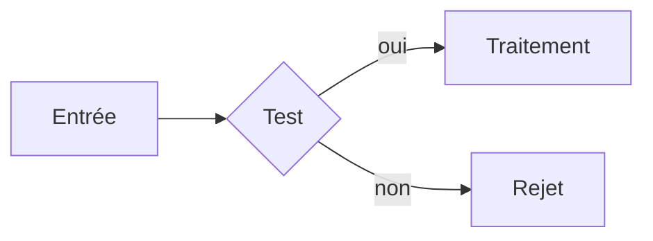

# Cours

Trois sources, un document :

- **diapos / poly du prof** (PDF) → l'autorité : plan, périmètre, vocabulaire, notations
- **photos de notes** (manuscrit, tableau, écran) → ce qui a réellement été dit et souligné
- **compléments** → ce qui manque pour que le cours tienne debout seul

## Entrée

Par défaut `./cours/<nom>/sources/` (photos + PDF), sortie `./cours/<nom>/cours.md` ; sinon le chemin donné. Créer l'arborescence si absente. `sources/` vide : dire où déposer, s'arrêter.

## Procédure

### 1. Inventaire

Lister `sources/`, classer : PDF (diapos, poly) vs images (notes, tableau).

### 2. Lecture intégrale — aucune source ignorée

- **PDF** : `Read` avec `pages`, par tranches de 20 max, jusqu'à la fin.
- **Images** : `Read` une par une, marges, soulignements, encadrés et flèches compris — c'est là qu'est l'insistance du prof.
- **Illisible** : le noter, ne jamais deviner.

### 3. Extraire, séparément, avant de rédiger

Dans le scratchpad :

- **Plan du prof** : titres, sections, ordre — le squelette, qu'on ne réorganise pas.
- **Notations et vocabulaire** : symboles, abréviations, termes exacts, repris tels quels (l'examen note le vocabulaire).
- **Insistances** : ce qui revient entre diapos et notes, le souligné, « à retenir », « tombe à l'examen ».
- **Trous** : démonstration sautée, terme jamais défini, exemple annoncé jamais donné, notes coupées net.

### 4. Rédiger

Dans l'ordre du prof, pour chaque section :

1. **Le contenu du prof d'abord**, en phrases complètes (le télégraphique des diapos devient de la prose), sans rien retirer ni réordonner.
2. **Les notes manuscrites au bon endroit** : l'exemple oral, la remarque, la précision absente de la diapo.
3. **Les trous** repérés en 3, comblés.

Forme selon la séance :

- **CM** — le cours suivi : plan du prof, définitions, démonstrations, théorie.
- **TD** — un exercice par section : énoncé, **méthode** (quelle technique, *pourquoi celle-là* — c'est elle qui se rejoue à l'examen, plus que le résultat), résolution détaillée, résultat. Les réflexes récurrents regroupés à la fin.
- **TP** — objectif, matériel ou outils, protocole pas à pas, mesures et observations, exploitation, sources d'erreur. Ce qui a mal tourné, et pourquoi, s'écrit.

### 5. Calibrer la longueur

Cible : **plus clair qu'une diapo, plus détaillé et corrigé que les notes** — un document qui se relit seul, sans prof ni diapos. Par section : **200 à 400 mots** de texte courant, hors formules, schémas et encadrés. Garde-fou, pas quota : une section dense déborde, une maigre ne se gonfle pas. Vocabulaire, récap et auto-test ne comptent pas.

**Digeste ne veut pas dire court** : un cours se lit vite parce qu'il est découpé, hiérarchisé et coloré, pas amputé. Trop lourd → couper les paragraphes, sortir les exemples en encadrés, jamais retirer du contenu. Chaque paragraphe doit apporter ce que le précédent n'a pas, sinon il saute.

| Se coupe sans hésiter | Se garde même si ça rallonge |
|---|---|
| les répétitions diapos/notes (écrit une fois, au meilleur endroit) | l'étape de calcul ou de démonstration sautée par le prof |
| le remplissage : « Introduction », « Nous allons voir », « Plan », rappels de titres | la définition d'un terme employé sans l'être |
| les reformulations qui ne clarifient rien | l'exemple qui rend la notion concrète |
| les transitions décoratives | le piège classique, la confusion fréquente |

On coupe le bavardage, jamais le raisonnement.

### 6. Les encadrés — la couleur porte le sens

Types, couleurs et dosage : cf. la charte. La couleur ne décore pas, elle dit comment lire la boîte avant qu'on l'ait lue.

**Marquer les ajouts reste non négociable.** Tout ce qui ne vient ni des diapos ni des notes va dans un `[!note] Complément` : à la relecture, il faut distinguer d'un coup d'œil ce qui vient du prof (examinable) de l'apport extérieur (à vérifier). Sans cette marque, le cours est inutilisable pour réviser.

Un encadré extrait un élément du cours, il ne remplace pas le texte courant : une section faite d'encadrés n'a plus que des marges.

### 7. Images, schémas et formules

Deux jeux d'images arrivent prêts, avec leurs liens `![[...]]` : **les photos de notes**, listées en tête de la demande, et **les pages de diapos marquées `SCHEMA OU FIGURE`** (lien dans l'en-tête `--- page N ---`) — un dessin, graphe ou tableau que le texte extrait ne rend pas. Les autres pages sont du texte seul, sans lien : leur contenu part dans le corps, l'image n'apporterait rien (on affiche une page pour ce qu'elle *montre*, pas pour ce qu'elle dit).

Principe : **le schéma du prof EST le cours** — le redessiner risque de trahir ce qu'il a voulu montrer.

- **Afficher l'image par défaut** quand la diapo ou le schéma au tableau est lisible et bien fait (schéma, tableau de synthèse, frise, graphe) : on colle, on ne reconstruit pas. Le `![[...]]` va là où la figure est discutée, **précédé d'une phrase qui dit quoi y regarder**, **suivi d'une légende en italique** qui résume le point clé — jamais d'images en vrac à la fin.
- **Une page `SCHEMA OU FIGURE` ne se laisse pas passer** : son texte se réduit souvent au titre, signe que l'essentiel est dans le dessin. Si la notion est traitée, la figure y va.
- **Deux sources montrent la même chose** : la meilleure — la diapo si propre et complète, la photo si le prof a ajouté au tableau ce que la diapo ne dit pas (flèche, annotation, cas particulier). Les deux seulement si elles se complètent, avec une phrase sur ce que la seconde ajoute.
- **Redessiner en Mermaid uniquement** quand aucune image ne convient (rien dans les sources, photo illisible ou trop petite) ou qu'un schéma gagne clairement à être refait (organigramme griffonné, diagramme mal cadré). Redessiner ce qui existe en bon état est du travail perdu et un risque de fausser le propos. Obsidian rend ` ```mermaid ` nativement :

````

```mermaid
flowchart LR
  A[Entrée] --> B{Test}
  B -- oui --> C[Traitement]
  B -- non --> D[Rejet]
```
````

- **Formules, matrices, systèmes en LaTeX** : `$...$` en ligne, `$$...$$` en bloc (MathJax), avec les notations exactes du prof.
- **Un tableau de données reste un tableau Markdown**, pas une image.
- Ne jamais inventer les valeurs d'une courbe pour la redessiner : illisible → on affiche la photo.

### 8. Rendre ça pédagogique — aérer, colorier, relier

L'étudiant est visuel : il retient un schéma, un tableau, un encadré coloré, pas un bloc de prose. **Penser diapo, pas dissertation** : le cours se scanne en diagonale, chaque notion saute aux yeux.

#### Mise en page aérée

- Un paragraphe = une idée ; entre prose et liste, la liste (elle se scanne).
- **`---` entre chaque sous-section `###`**.
- Après chaque notion importante, un encadré coloré (`[!tip]`, `[!example]`, `[!danger]`) ; le texte courant lie les encadrés, il n'est pas le véhicule principal.
- `##` une grande partie, `###` une notion, `####` seulement pour de vrais sous-cas, jamais plus profond.
- **Titres du corps numérotés** (`## 3. Domaines critiques`, `### 3.1 Le transport`) : une prise pour réviser « la 4.2 ». **Les quatre sections de fin gardent leur titre exact, sans numéro** — `## Vocabulaire à retenir`, `## Récap`, `## Auto-test`, `## Sources` — ce sont les cibles des liens.

#### Le code couleur du texte — un marqueur, un rôle

| Marqueur | Rendu | Rôle | Dosage |
|---|---|---|---|
| `**[[#Vocabulaire à retenir\|terme]]**` | **or, cliquable** | terme du vocabulaire, première apparition | une fois par terme |
| `==texte==` | **rouge gras souligné** | l'important : règle, résultat, ce qui tombe à l'examen | 1 à 2 par partie `##` |
| `**gras**` | encre chaude | une notion appuyée, sans définition dédiée | avec parcimonie |
| `` `code` `` | teal | notation, symbole, nom de fichier ou de commande | à chaque fois |
| `*italique*` | gris | nuance, aparté, légende de figure | libre |
| `> citation` | encadré or | énoncé cité mot pour mot : principe, théorème, définition du prof | quand le prof dicte |

**Le rouge, la couleur la plus forte, ne vaut que par sa rareté** : un paragraphe surligné ne surligne rien, une page toute en gras n'a plus de gras. Dans le doute, ne pas marquer.

#### Liens internes — vocabulaire et notions cliquables

- **Terme du vocabulaire, première apparition** : gras + lien vers le tableau de fin — `Le **[[#Vocabulaire à retenir|cahier des charges]]** est…`
- **Notion définie plus haut, réutilisée** : lien vers son titre — `Comme dans le [[#4.2 Le modèle en V|modèle en V]], chaque étape…`
- **Retour** : dans le tableau, le terme renvoie à la section qui l'explique — `| **[[#4.2 Le modèle en V|Modèle en V]]** | construction à gauche, vérification à droite | conception, tests |`

Un clic dans le cours mène à la définition, un clic dans le tableau ramène à l'explication. Le terme est or des deux côtés (même mot, même couleur partout) ; le violet est pris par `[!tip] À retenir` — un rôle par couleur.

#### Pédagogie par notion

En plus de l'ordre de la charte :

- **Définition avant usage** — jamais un terme employé avant d'être défini ; gras + lien interne à sa première apparition, une seule fois.
- **Le pourquoi** — à quel problème la notion répond, ce qu'on faisait avant et pourquoi ça ne suffisait plus : sans son motif, elle ne se retient pas.
- **L'exemple parlant** vient d'un monde que l'étudiant connaît (un logiciel dont il se sert, une situation vécue, des chiffres qu'il refait de tête) et il est *déroulé* : situation précise → notion appliquée → résultat → ce que ce résultat prouve. Deux exemples courts et opposés (ça marche / ça casse) valent mieux qu'un long.
- Un exemple inventé est un ajout : `[!note] Complément`, ou « par exemple » qui le donne pour ce qu'il est. Celui du prof n'a besoin d'aucune marque.

#### Illustrer visuellement — un élément visuel par section `###`

Pour chaque notion abstraite, dans cet ordre de préférence :

1. **La diapo du prof** qui porte déjà la figure (`![[…]]`) — le plus fidèle, le moins de travail.
2. **La photo de notes** quand le prof a dessiné au tableau.
3. **Tableau comparatif** dès qu'on oppose deux concepts (cascade vs V) — jamais de prose pour comparer : deux colonnes, une ligne par critère.
4. **Schéma Mermaid** pour processus, flux, hiérarchies, cycles de vie, quand rien d'existant ne va : cycle → `flowchart`, hiérarchie → arbre, chronologie → `flowchart LR`.
5. **Tableau récapitulatif** pour propriétés, critères, étapes.

**Au moins un visuel par section `###`, jamais deux sections de suite sans** : la question n'est pas « faut-il un visuel ? » mais « lequel ? ».

#### Fin de document

Dans cet ordre :

- **Vocabulaire à retenir** : tableau `| Terme | Définition | Où ça sert |`, tous les termes marqués, dans leur ordre d'apparition ; titre exact (cible des liens). **Chaque terme est un lien vers la section qui l'explique** (`| **[[#3.1 Le transport|domaine critique]]** | … |`) ; définition d'une ligne, compréhensible sans revenir au corps.
- **Récap** : le squelette du cours en 10 lignes.
- **Auto-test** : 5 à 8 questions dans un `[!question]`, du rappel à l'application, réponses dans une section repliée.

### 9. Sortie

Chemin de sortie donné dans la demande. En-tête :

```yaml
---
matiere: <matière>
type: <CM | TD | TP>
titre: <titre>
sources: <n> PDF, <n> photos
date: <YYYY-MM-DD>
tags: [cours, <matière en minuscules sans accents>, <cm|td|tp>]
---
```

En fin de fichier : `## Vocabulaire à retenir`, `## Récap`, `## Auto-test`, `## Sources` (chaque fichier lu et ce qui en a été tiré). Si le serveur MCP `mcp-obsidian` répond, proposer d'écrire la note dans le vault — pas sans accord.

## Règles

- Ne jamais inventer un chiffre, une date, une référence ou une formule en le présentant comme du prof.
- Ne jamais résumer : un cours complet, pas une fiche (la fiche se dérive du cours, pas l'inverse).
- Contradiction diapo/notes : signalée, jamais arbitrée en silence.
- Photo illisible : signalée, pas comblée.
